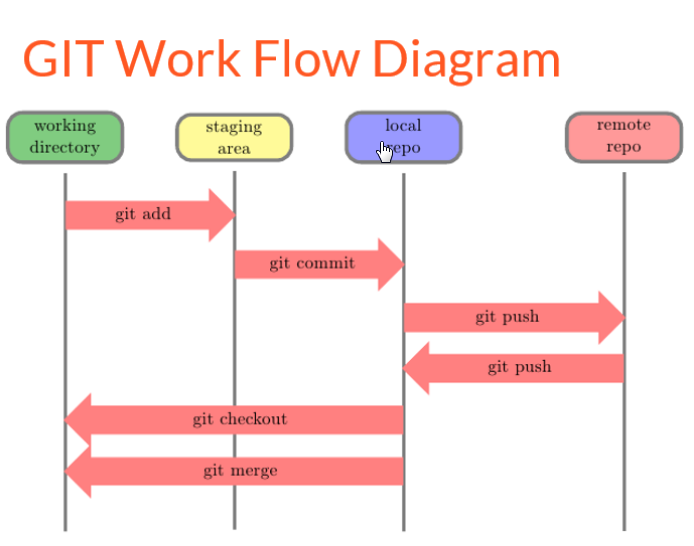

# Not really done tutorial that will hopefully help some.

<!-- TOC depthFrom:1 depthTo:6 withLinks:1 updateOnSave:1 orderedList:0 -->

- [Not really done tutorial that will hopefully help some.](#not-really-done-tutorial-that-will-hopefully-help-some)
- [bitbucket](#bitbucket)
- [Git](#git)
	- [downloading git](#downloading-git)
	- [using git](#using-git)
	- [connecting to existing repos](#connecting-to-existing-repos)
	- [git a little more](#git-a-little-more)
	- [top 5 commands](#top-5-commands)
- [Markdown](#markdown)
	- [What is it](#what-is-it)
	- [syntax examples](#syntax-examples)
- [Atom Text Editor](#atom-text-editor)
	- [How to download](#how-to-download)
	- [basic features](#basic-features)
- [H1 Heading](#h1-heading)
	- [H2 Heading](#h2-heading)
		- [H3 Heading](#h3-heading)

<!-- /TOC -->

# bitbucket

Bitbucket is on online repository (repo) that allows you to share code with other. Github is probably the most popular of these online repos but bitbucket offers one distinct advantage. You can host private repos for up to 5 people. So it's perfect for our team structure.

Sign up for an account [here](https://bitbucket.org/account/signup/)

We will come back to this later.

# Git

Git is a version control software system that is managed via the command line.
Using git will help you understand command line and that is a good thing!
Let's start by opening command prompt

**windows**
 open the command prompt by pressing windows key and typing in "cmd" press enter
 this is where you can directly tell you computer to do things. Lets start by checking if our computer has a 32 or 64 bit operating system
 A quick google and we find this [statement](https://superuser.com/questions/321988/how-do-i-determine-if-my-windows-is-32-bit-or-64-bit-using-a-command)
 ```cmd
 wmic os get osarchitecture
 ```
 Copy this statement exactly and paste it into you command prompt. Press enter

 

 In this example I am using a 64 bit operating system. This will help us when we go to download git.


## downloading git
Go to this [link](https://git-scm.com/downloads)
select the appropriate operating system (*which you know now because of your cmd skills*)
Run through the installer accepting all the suggested options

Once installed right click on your desktop and you should see something new.


go on open it.

This look similar to cmd line but allows you to use the commands that git understand. Windows Command Prompt does not support the language used by git so we get around it by opening a "Git Bash". All your interaction with the online repos will take place through git bash.
You can open the git bash in any folder.

## using git  

Let's try it out.

navigate to a folder you can store some information in. something like D:/projects

Once there open a git bash.
The goal now is to create a new folder and add a file to that folder using commands in git bash

Enter the following commands one and a time and look at the results
```bash
mkdir projectFolder

cd projectFolder

ls

touch readme.txt

ls
```
Here is a break down
mkdir: this creates a new file directory. A new folder named 'projectFolder' should of appeared. You can new the folder anything.

cd: this changes directory to the new folder that you created

ls: this list all the files that are present in the folder. the first time you call it nothing appears, because there is nothing in the folder.

touch: this creates a new file. You have to specify the name and the extension. after this the ls command returns the newly created file.

## connecting to existing repos
So while git bash is cool, at the end of the day it's just a tool to allow use to share our work and connect to other through online repos. So lets try that out.

Let's go to a public github site and get some code
follow this [link](https://github.com/dcarver1?tab=repositories)
select the repo name **"markdownLesson"**

On the right side of the page select the green button that says download or clone.

We could download the information but now that we have our git bash set up let's just clone the repo instead.

Copy the url using right click copy


Open Git bash in your newly create folder 'projectFolder' and enter the flowing line
```cmd
git clone https://github.com/dcarver1/markdownLesson.git
```
You can simple right click and paster the copied url in to the command line after 'git clone'

Try changing directory to the new repo and looking at the files present
```bash
cd markdownLesson

ls
```
There are multiple markdown files and a few png

It's as easy as that. You use this method to access the 10,000,000 + repos present on gitHub today. :)

## git a little more

There is a structure to git that is important to understand if you want to relie on it. It may feel complicated and it can certainllu get there. But we are using git for a very specific purpose.  
Git connects your local repo to an online one so files edited on your computer can be easily accessed by other.

The flow chart below is a great reference to the major functions of git. Take a look and write down a question or two about what is not clear from the diagrahm.



## top 5 commands
As you get more familar with the process the use of these methods will become second nature but for the time being were going to cover 5 very useful commands to get things going

Navigate to any file folder on your computer, open a git bash, and enter the following code
```Bash
git status
```
You should get something along the lines of
>'fatal: Not a git repository (or any of the parent directories): .git'

What this means is you open the git bash in a folder that does not contian a git repo.

Navigate to the markdownLesson repo you cloned from git hub, open the git bash, and enter git status.

The message you should receive is something like this.
> 'On branch master
Your branch is up-to-date with 'origin/master'.
nothing to commit, working directory clean'

This means that your local repo is the same as the online one. Which makes sense because we just clones that repo.

**git Status** will indicate the relationship between the local repo and the online repo. Start with git status to make sure your working on and have shared the most up to date version of the document.

We will get the chance to work more with these commands in just a bit but for now here are the definitions on 4 other common commands.

** git add <fileName> ** this command adds your the edits you made to a doc to a stageing area. replace <fileName> with the name of your file or use the * symbol to add all files in the repo to the stanging area.

** git commit -m'your message here' ** The commit command is your way of saying this doc is ready to be pushed to the online repo. Because git is a version control software it save all the edits you make on this new version. So the -m command allows you to make a quick reference to what you did during this editing section. at typical message is -m'I added to the conculsion'

** git push ** now that your doc is staged and committed, you can push it to the online repo for storage. The push command updates the online repo to match the edits you made in you local repo.

** git pull ** This pulls files from an online repo to a local repo. this is how you get updates that other pushed to the shared repo.

Understanding this process will come quick with just a little practice so let's change gears a bit and see some of this information applied.

# Markdown
## What is it
## syntax examples


# Atom Text Editor
Git works well with text documents. These include plain text files (.txt), markdown(.md), programming laguages such as R (.r),python (.py), and JavaScript(.js) plus many others. What is doesn't work as well with is highly formatted documents such as microsoft word (.docx). This is because .docx files have lot's of built in functionalities that are unique to the document. That is why an empty word doc already contains multiple mb of information where as the md file that this tutorial is built on is under 1 mb.

What this all comes down to is that if you want to start using git regularily it is very helpful to have a text editor. Think note pad. The bare bones text editor that looks so boring you never want to use it. While it would function just fine we're going to use a more modern free and open source platform, [Atom](https://atom.io/).

We're going to cover setting up atom on your computer and show case some of the built in functionalities that make it a really excelent text editor for writing in plain text or your computer programming language of choice.

## How to download
So like most other free and open source software it is hosted on git hub. Head to the [atom download page](https://github.com/atom/atom/releases/tag/v1.23.3) and grap you some community developed code. In this case no cloning is needed. Just click to download.

** windows ** download the zip version and extract it to where you want it to run from. C:/programFiles is a good option. Inside there will be an exicutable (.exe) which will run the installer. Double click and run thorugh keeping all the defaults.

** add some pictures of this process from the windows perspecive **

Once you've got in installed open it up
windows key -> type in atom -> select the cool looking icon

When you open atom a welcome page will be there to great you. Take a little bit of time to run through these pages and absorb a little bit of the functionality.

## basic features
If it all seems a little overwhelming, that's ok, because it kinda is. There is a different culture around free and open source software (FOSS). People want you to customize it and make it you own. It's ment to be tinkered with. So naturally there is alot of options. Let's start with a fun one.

Go to
> Edit -> Prefferences

Once the page opens select the themee tab on the side


Toggle through the theme to see which on speaks to you. There are some stock options and also resources for downloading other themes from other online repos.
Now with you theme selected all your boss will be looking over your shoulder at work and thinking to them selves "Wow, they are really know all that computer stuff I should pay them more." :)

While themes are fun they don't really get work done. Let's check out some more praticle aspects of atom.

- **adding projects**

Projects are as they sound. In atom the project is an organizational structure that allows you to interact with specific packages within atom. Lets add on

> File -> Add Project Folder

Navigate to the markdownLesson that we downloaded earlier in this tutorial. Select the folder that the tutorial is housed in and add it.

Now this is cool. On the left side of the text editor you should see a tree version of the newly added project folder. It should look something like the image below.


In the folder are a lot of image files (.png) and a markdown file (.md) double click on the markdown file it should open in a new pane in the editor. This is the exact file that was used to create this tutorial so if you want to go back and fix some of those glaring misuses of the english language, like add two 'f' to preferences, have at. It's FOSS, that's how it works.


- viewing markdown

This document was writen using markdown language. This is a simple programmming language that using symbols to reference html text formatting so

<h1> this is a header 1 </h1>
becomes
'# this is a header 1'

Because it can be converted to html it can then be convert to basically any text format out there. Html is the core language of the internet to so it's really the base of alot of digitially represented material. I could of writen this doc using html and got the same look but I would of been much more difficult for read and my pinkies would hurt from all the shift holding needed to get all those special characters in it.

So when it comes down to it. Markdown is a simple plaintext language that allows you to use version control software such as git. The best way to see learn markdown is to look at a raw document and a published version of one. We can do that in atom using a built in package called *Markdown Preview*
You can access this by
> Packages -> Markdown Preview -> Toggle Preview

or with the hot key
> ctrl + shift + m

**Bold	text**

*Emphasize text*

~~Strike-through~~

[Link to website ](https://blog.ghost.org/markdown/)

```R
rCode -> 'whoa inline code chucks'
```

```python

pythonCode = 'silly R you should learn python. Why does -> mean equals anyway?'

```

Image from the intertubes! 	

* i'm a list item
1. I'm am a list item in order

> this is a blockquote

# H1 Heading	 
## H2 Heading
### H3 Heading


This list goes on. But the deal is you can emulate all the functionality of your word processer in the this simple plain text format.

- adding packages

So we now know what make down code looks like and we can write in it. Before we get into the details of why exactly markdown is so awesome let's
